<div align="center">



[](https://reapsec.com)
[](https://blog.reapsec.com)
[](https://www.linkedin.com/in/mohit-papola)

</div>

---

```console
root@reapsec:~# whoami
```

Security researcher working primarily in **red teaming**, **OSINT**, **cryptography** and **steganography**.
I write up what I break at **[blog.reapsec.com](https://blog.reapsec.com)** — machines, challenges, and the
occasional exploit that needed fixing before it would even build.

Currently expanding into binary exploitation and reverse engineering.

---

## `~/ latest writeup`

<!-- WRITEUPS:START -->

<table width="100%">
<tr><td align="center">

<a href="https://blog.reapsec.com/sendai-htb"></a>

### [Sendai](https://blog.reapsec.com/sendai-htb)

<sub>`06 August 2026`</sub>

   

<a href="https://blog.reapsec.com/sendai-htb"><b>Read the writeup &rarr;</b></a>

</td></tr>
</table>

<sub>Latest post, synced automatically from <a href="https://blog.reapsec.com">blog.reapsec.com</a></sub>

<!-- WRITEUPS:END -->


---

<div align="center">

<picture>
  <source media="(prefers-color-scheme: dark)"  srcset="./assets/snake.svg" />
  <source media="(prefers-color-scheme: light)" srcset="./assets/snake-light.svg" />
  
</picture>

<sub><code>All security work is conducted in authorized labs, CTF competitions, and sanctioned engagements.</code></sub>

</div>
