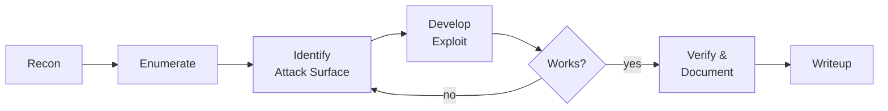

<div align="center">


<br/>

[](https://reapsec.com)
[](https://github.com/MOHITSINGHPAPOLA)
[](https://github.com/MOHITSINGHPAPOLA?tab=followers)
[](https://github.com/MOHITSINGHPAPOLA?tab=repositories)

</div>

---

```console
root@reapsec:~# cat /etc/profile.d/whoami.sh
```

```yaml
handle:      MOHITSINGHPAPOLA
site:        https://reapsec.com
role:        Security Researcher / CTF Player
focus:
  - binary exploitation (pwn)
  - reverse engineering
  - web application security
  - cryptography challenges
environment: Kali Linux · zsh · tmux · neovim
philosophy:  "Read the source. Then read it again."
```

---

## `~/ arsenal`

<table>
<tr>
<td valign="top" width="50%">

**Exploitation & Pwn**


</td>
<td valign="top" width="50%">

**Web & Network**


</td>
</tr>
<tr>
<td valign="top">

**Languages**


</td>
<td valign="top">

**Platform**


</td>
</tr>
</table>

---

## `~/ methodology`



---

## `~/ stats`

<div align="center">


<br/>


</div>

---

## `~/ ctf`

> Writeups are published at **[reapsec.com](https://reapsec.com)** after the event ends and the challenge is retired.

<div align="center">

[](https://ctftime.org/team/380077)
[](https://app.hackthebox.com/users/2069108)
[](https://tryhackme.com/p/mohitsinghpapola)

<br/>

<a href="https://app.hackthebox.com/users/2069108"></a>
<a href="https://tryhackme.com/p/mohitsinghpapola"></a>

</div>

**Categories I play:** `pwn` · `rev` · `web` · `crypto` · `forensics` · `misc`

---

## `~/ contact`

<div align="center">

[](https://reapsec.com)
[](https://github.com/MOHITSINGHPAPOLA)
[](https://www.linkedin.com/in/mohit-papola)
<!-- TODO: add if you use it
[](https://x.com/USERNAME)
-->

</div>

---

<div align="center">
<sub><code>All security work shown here is conducted in authorized labs, CTF competitions, and sanctioned engagements.</code></sub>
</div>
